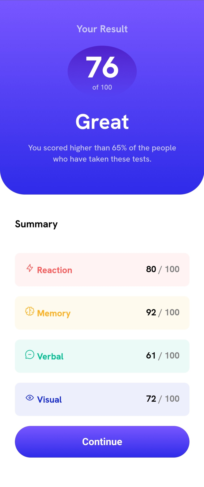

# Frontend Mentor - Results summary component solution

This is a solution to the [Results summary component challenge on Frontend Mentor](https://www.frontendmentor.io/challenges/results-summary-component-CE_K6s0maV).

## Overview

### The challenge

Users should be able to:

- View the optimal layout for the interface depending on their device's screen size
- See hover and focus states for all interactive elements on the page

### Links

- Live Site URL: https://results-summary-component-raj.netlify.app

### Built with

- Semantic HTML5 markup
- CSS custom properties
- Flexbox

## Author

- Frontend Mentor - [@raj-pandey55](https://www.frontendmentor.io/profile/raj-pandey55)
- Twitter - [@rajpandeyyyy](https://www.twitter.com/rajpandeyyyy)
